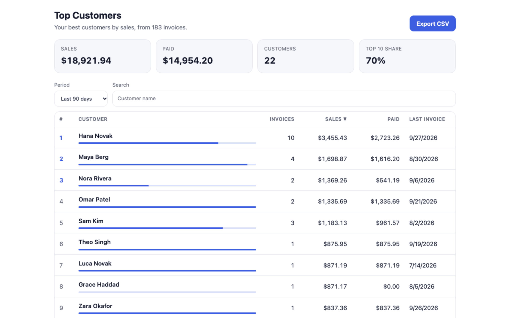
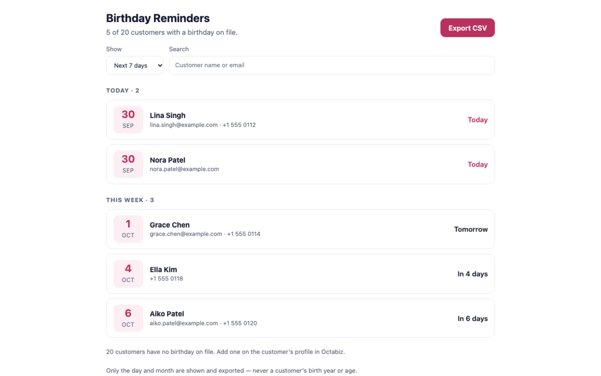
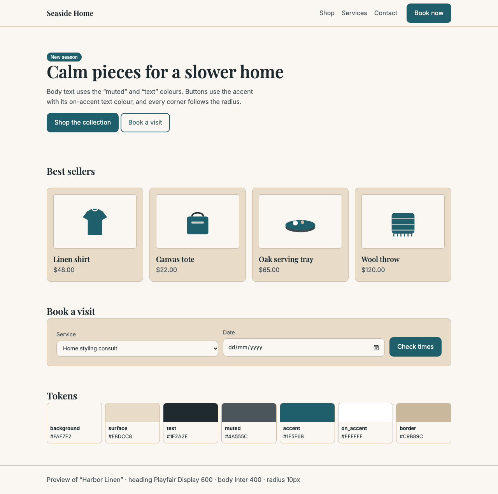

# Ocean Market examples

Complete, working examples of everything you can build for **Ocean Market**, the Octabiz app store: embedded apps, landing page templates and store themes. Each one is a real listing that went through Octabiz review. Download the repo, run an example on your computer, change it, and submit your own.

<table>
  <tr>
    <td width="50%"><a href="examples/embedded-top-customers"></a><br><b>Top Customers</b> · embedded app</td>
    <td width="50%"><a href="examples/embedded-birthday-reminders"></a><br><b>Birthday Reminders</b> · embedded app</td>
  </tr>
  <tr>
    <td><a href="examples/landing-template-bright-clinic"></a><br><b>Bright Clinic</b> · landing page template</td>
    <td><a href="examples/store-theme-harbor-linen"></a><br><b>Harbor Linen</b> · store theme</td>
  </tr>
</table>

| Example | What it is | What it shows you |
| --- | --- | --- |
| [Top Customers](examples/embedded-top-customers) | Embedded app | Reading invoices through the bridge, paging, summary cards, sorting, CSV export, loading, empty and error states |
| [Birthday Reminders](examples/embedded-birthday-reminders) | Embedded app | Reading customers, date handling (Feb 29), grouping, privacy by design (day and month only) |
| [Bright Clinic](examples/landing-template-bright-clinic) | Landing page template | Nine editable sections, repeating lists, images, brand colours that follow the business, mobile layouts |
| [Harbor Linen](examples/store-theme-harbor-linen) | Store theme | Every theme token, font and radius, with readable contrast |

## What you need

- **Node.js 18 or newer.** The tools in `tools/` use only Node's built-ins, so there is nothing to install.
- **An Octabiz developer account** when you're ready to submit. Sign up at [octabiz.ai/developer](https://octabiz.ai/developer), then choose a developer plan under **Developer → Billing**. A new account has no plan yet, and you need one to publish. If the **New app** screen shows “Needs Pro plan” next to *Embedded app* or *Connector*, your plan doesn't include that type yet.

## Quick start

```bash
git clone https://github.com/Octabiz/ocean-market-examples.git
cd ocean-market-examples

# Run an embedded app inside a mock Octabiz with sample data
node tools/dev-host.mjs examples/embedded-top-customers
#   → open http://localhost:4400

# Preview a landing page template, optionally in another brand colour
node tools/preview.mjs examples/landing-template-bright-clinic --primary=#7C3AED
#   → open http://localhost:4300

# Preview a store theme on a sample store
node tools/preview.mjs examples/store-theme-harbor-linen
```

## The workflow

1. **Copy an example** that's closest to what you want to build, and rename the folder.
2. **Develop locally.** Use `dev-host.mjs` for apps and `preview.mjs` for templates and themes. Reload to see your changes.
3. **Check it** with the same rules Octabiz runs on upload:
   ```bash
   node tools/validate.mjs examples/your-folder
   ```
4. **Package it:**
   ```bash
   node tools/pack.mjs examples/your-folder
   #   → dist/your-folder-1.0.0.zip   (or .theme.json for a theme)
   ```
5. **Submit it** in the developer portal: **My apps → New app**. Pick the type, upload the file from `dist/`, and fill in the listing: description, icon (512×512 PNG), at least one 1280×800 screenshot, and your support, privacy and terms links. Then press **Submit for review**.
6. **Review.** An Octabiz reviewer checks the listing, reads your code, and tries the app with sample data. You'll see their notes on the app's **Versions** tab. You can reply there, fix the problem and resubmit. Approved listings go live in Ocean Market straight away.

## How Octabiz runs your work

- **Embedded apps** run in a sandboxed frame inside Octabiz. Octabiz serves the exact build it reviewed, from its own servers, so businesses always run the reviewed code. Your app never gets a login token or a database connection. It asks Octabiz for data through a small, permission-checked message bridge. See [docs/embedded-apps.md](docs/embedded-apps.md).
- **Landing page templates** are HTML and CSS sections with settings. Businesses add them in the page builder and edit every setting there: text, images, colours, links and lists. See [docs/landing-templates.md](docs/landing-templates.md).
- **Store themes** are a set of colour, font and corner-radius tokens for a business's booking site and online store. See [docs/store-themes.md](docs/store-themes.md).

Before you submit, read [docs/review-guidelines.md](docs/review-guidelines.md). It covers what reviewers check and the most common reasons a version is sent back.

## Repository layout

```
examples/                  four complete, reviewed examples
docs/                      format references and review guidelines
tools/
  dev-host.mjs             run an embedded app inside a mock Octabiz
  preview.mjs              preview a template or a theme
  validate.mjs             run Octabiz's upload checks locally
  pack.mjs                 build the file you upload
```

## License

MIT. Use these examples as the starting point for your own apps.
