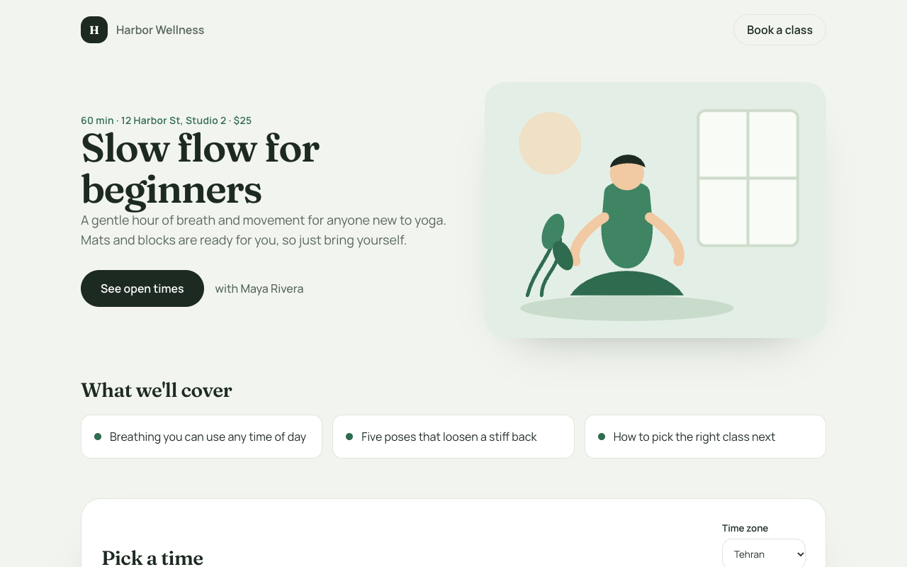
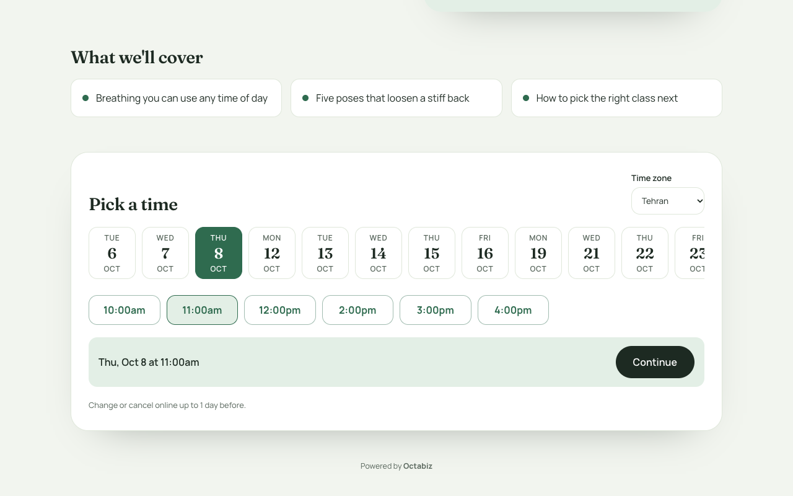
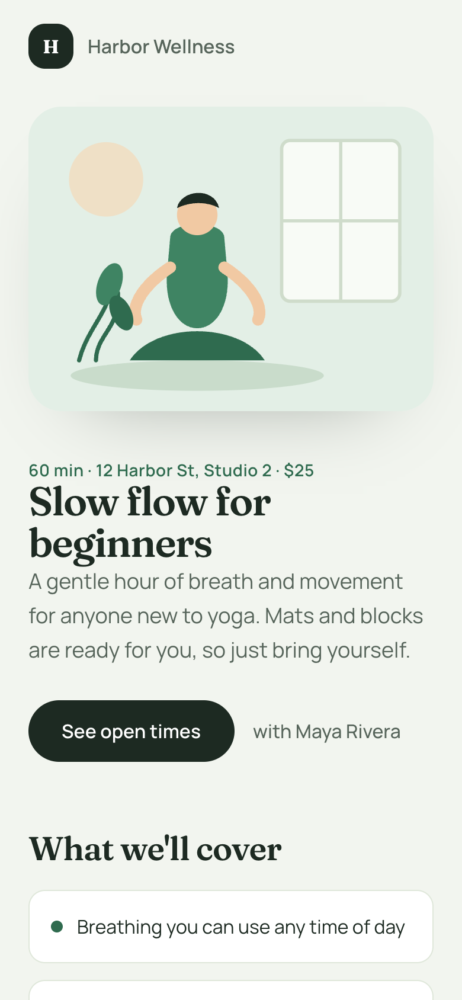

# Flow Yoga — booking page template

A booking theme with its **own service page**: instead of the standard calendar card, customers land on a page with a hero, "What we'll cover" cards and a day strip with times. Your details, Booked and the manage pages stay the built-in ones, in Flow Yoga's tokens.

| The service page | Picking a time |
| --- | --- |
|  |  |



## What's in it

```
theme.json            tokens (green, Fraunces / Manrope, round corners) + "pages": { "service": "booking/service.html" }
booking/service.html  the page: prints service data with {{ … }}, holds the required elements
booking/service.css   styles, every colour and corner from var(--bk-*)
booking/service.js    behaviour, only through window.octabizBooking
assets/hero.svg       the illustration
```

What it shows you:

- **Page data:** `{{ service.name }}`, `{{ service.priceText }}`, `{{ service.host.name }}`, and `{{#each service.highlights}}` for the bullet cards.
- **Open times from Octabiz:** `getMonth` for the day strip and `getSlots` for a day's times. The page never works out availability itself.
- **Holding a time:** **Continue** calls `hold()`, then `navigate('details', { hold })`. If the time just went, the plain-sentence error is shown as it is and the day's times refresh. Try it with `?error=taken`.
- **Required elements:** the time zone picker (`<select data-bk="timezone">`), the cutoff line (`{{ service.cutoffText }}`) and `data-bk="powered-by"`.
- **Corners and accent follow the business:** the CSS writes no radius except through `--bk-r*`, so the Corners and Accent settings still work on a custom page.

## Run it

```bash
node tools/preview.mjs examples/booking-template-flow-yoga    # → http://localhost:4300 (mock booking SDK + sample data)
node tools/validate.mjs examples/booking-template-flow-yoga   # schema, contrast, required elements, safety
node tools/pack.mjs examples/booking-template-flow-yoga       # → dist/booking-template-flow-yoga-1.0.0.zip
```

## Make it yours

Change the layout in `booking/service.html` and `service.css`, or add more pages (`details`, `confirmed`, `manage`…) to `pages` in `theme.json`. Keep the required elements on every page you add. [docs/booking-themes.md](../../docs/booking-themes.md) lists the data each page gets.
