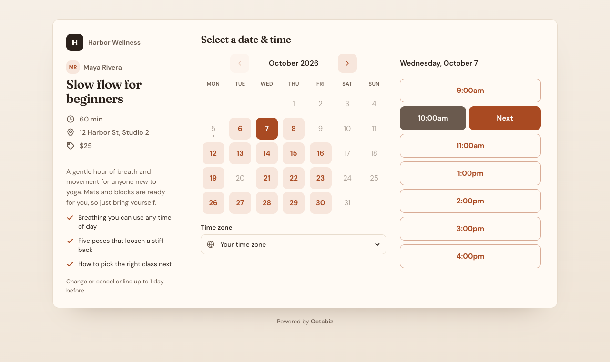
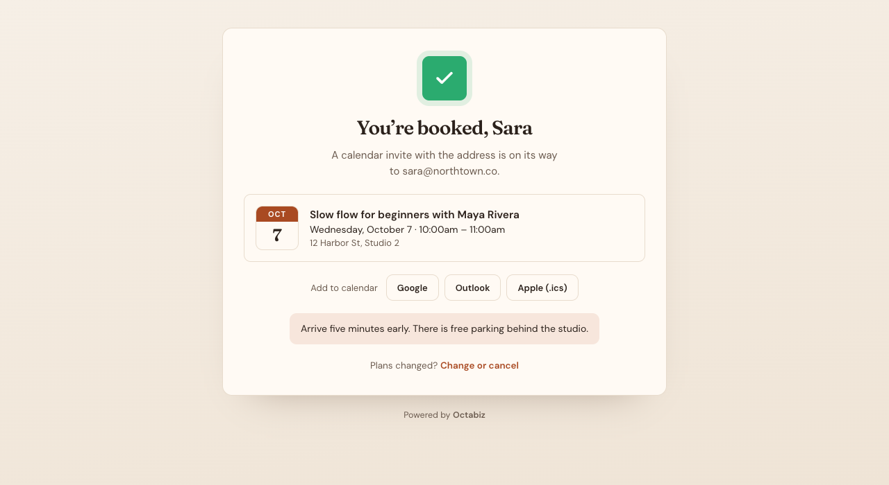
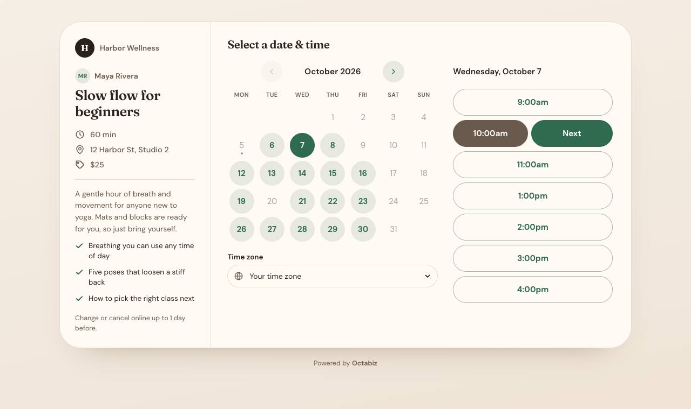
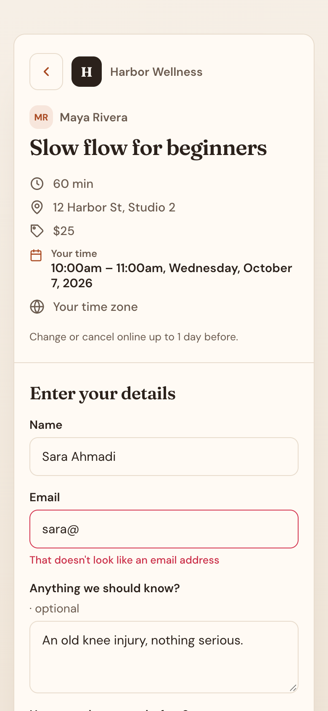

# Clay Studio — booking theme

Warm paper, a terracotta accent and Fraunces headings for salons, studios and makers. It's a **tokens-only** booking theme: one `theme.json`, and every built-in booking page picks it up.

| Picking a time | Booked |
| --- | --- |
|  |  |

| A business picks green and circle corners on install | On a phone |
| --- | --- |
|  |  |

| Token | Value | Why |
| --- | --- | --- |
| extends | `studio` | Starts from the Studio preset and changes only what it needs |
| accent | `#a94a22` | Sets primary, onPrimary and soft (5.7:1 for text on it, 4.7:1 for open days) |
| page | soft paper gradient | The page behind the card |
| surface / ink / muted | `#fffaf4` / `#2b211b` / `#6a5a4e` | 15.1:1 and 6.4:1 on the card |
| cta / onCta | `#2b211b` / `#fffaf4` | **Book it** stays dark whatever accent a business picks |
| fonts | Fraunces / DM Sans | Headings / everything else |
| corners | `soft` | 14px card, 10px everything else |

**Settings a business sees on install:** Accent, Corners and Heading font. The accent setting maps to `accent`, which is why `tokens` leaves out `primary`, `onPrimary` and `soft`: written-out tokens would win, and the setting would do nothing.

## Run it

```bash
node tools/preview.mjs examples/booking-theme-clay-studio     # → http://localhost:4300 (every booking screen)
node tools/validate.mjs examples/booking-theme-clay-studio    # schema, contrast, fonts
node tools/pack.mjs examples/booking-theme-clay-studio        # → dist/booking-theme-clay-studio-1.0.0.booking-theme.json
```

## Make it yours

Change `extends`, the accent and the tokens, then run `validate.mjs` until every contrast pair passes. Try your settings in the preview's top bar, the way a business would on install. See [docs/booking-themes.md](../../docs/booking-themes.md) for every token.
