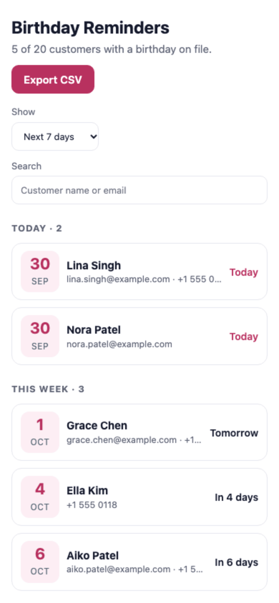

# Birthday Reminders — embedded app

Lists customers whose birthday is **today**, **this week** or **later** in the chosen period, so staff can send a note or a small offer on time. It also exports the list as CSV.

<picture>
  <source media="(prefers-color-scheme: dark)" srcset="screenshots/app-dark.png">
  
</picture>

<p align="center"></p>

**Permission:** `customers:read`.

## What it shows you

- **Filtering on the server.** `customers.list` with `with_birthday: true` returns only customers who have a date of birth, and a second unfiltered pass counts the customers who don't have one yet.
- **Date handling.** The next birthday on or after today, in local time. Feb 29 birthdays are marked on Feb 28 in non-leap years.
- **Privacy by design.** The birth year is dropped as soon as the data loads, so the app never shows or exports a year or an age. This was the reason v1.0.0 was sent back in review.
- **Grouped results.** Today, This week and Later, with counts, a search box, and five period choices.
- **Every state.** Not embedded, missing permission, nobody with a birthday on file, nothing in this period, and no search match.

## Run it

```bash
node tools/dev-host.mjs examples/embedded-birthday-reminders   # → http://localhost:4400
```

The mock host's sample data puts birthdays around today, including one on Feb 29.

## Make it yours

- Want to message customers? Messaging needs the "Messages your customers" disclosure in the portal and a permission that allows it. Keep this app read-only, and link to Octabiz's own messaging instead.
- Package and check it: `node tools/pack.mjs examples/embedded-birthday-reminders`.
