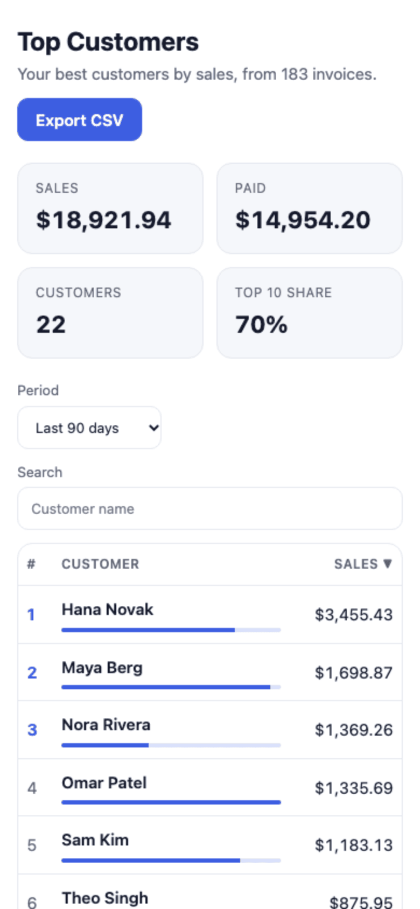
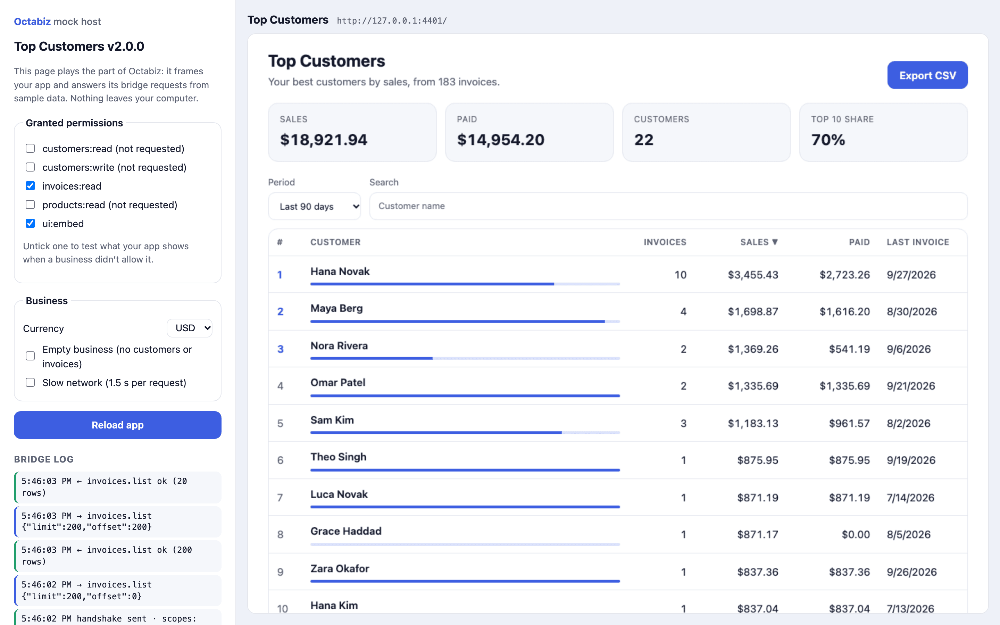

# Top Customers — embedded app

Ranks a business's customers by sales for a chosen period, shows how much each has paid, and exports the list as CSV.

<picture>
  <source media="(prefers-color-scheme: dark)" srcset="screenshots/app-dark.png">
  
</picture>

| On a phone | Inside the mock Octabiz (`tools/dev-host.mjs`) |
| --- | --- |
|  |  |

**Permission:** `invoices:read`. Customer names come on each invoice, so the app never needs `customers:read`.

## What it shows you

- **The bridge.** `OctabizBridge.ready()`, `hasScope()`, and `listAll()` paging through up to 5,000 invoices, 200 at a time, with progress.
- **Computing in the browser.** Invoices are grouped by customer, with drafts and invoices without a customer left out. Nothing is stored or sent anywhere.
- **Summary cards.** Sales, paid, customer count, and the share of sales from the top 10 customers.
- **An interactive table.** Period filter, search, and sortable columns (keyboard-accessible buttons with `aria-sort`), plus a paid-share bar per customer.
- **Money in the business's currency** through `formatMoney()`.
- **A safe CSV export.** A guard against formula injection that leaves plain numbers, including negative ones, alone.
- **Every state.** Loading with progress, not embedded, missing permission, no invoices, no search match, and errors.
- **Light and dark mode**, and a phone layout that drops two columns.

## Files

| File | What it does |
| --- | --- |
| `index.html` | Markup only; no inline scripts, as the CSP requires |
| `app.js` | Loads, groups, sorts and renders the data, and exports the CSV |
| `octabiz-bridge.js` | The shared bridge client (copied from the repo) |
| `styles.css` | Plain CSS with light and dark variables |
| `app.json` | Name, version and permissions |

## Run it

```bash
node tools/dev-host.mjs examples/embedded-top-customers   # → http://localhost:4400
```

In the mock host, untick `invoices:read` to see the missing-permission message, and tick **Empty business** or **Slow network** to see those states.

## Make it yours

- Add a column: extend `aggregate()`, then add a `<th>` with a `data-sort` key and a cell in `render()`.
- Need customer emails too? Add `customers:read` to `app.json`, load `customers.list` alongside the invoices, and join on `customer_id`.
- Package and check it: `node tools/pack.mjs examples/embedded-top-customers`.
