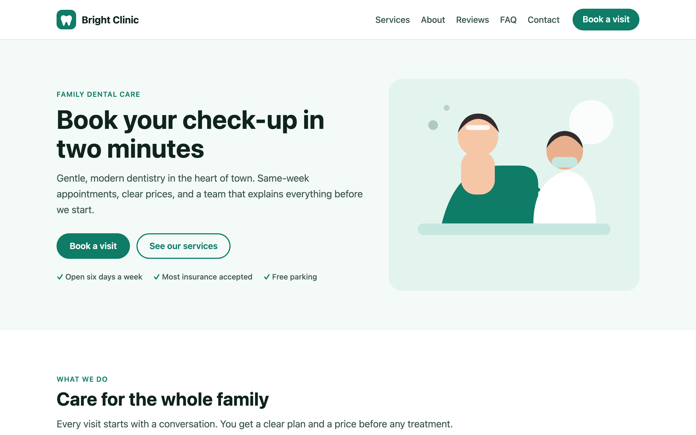
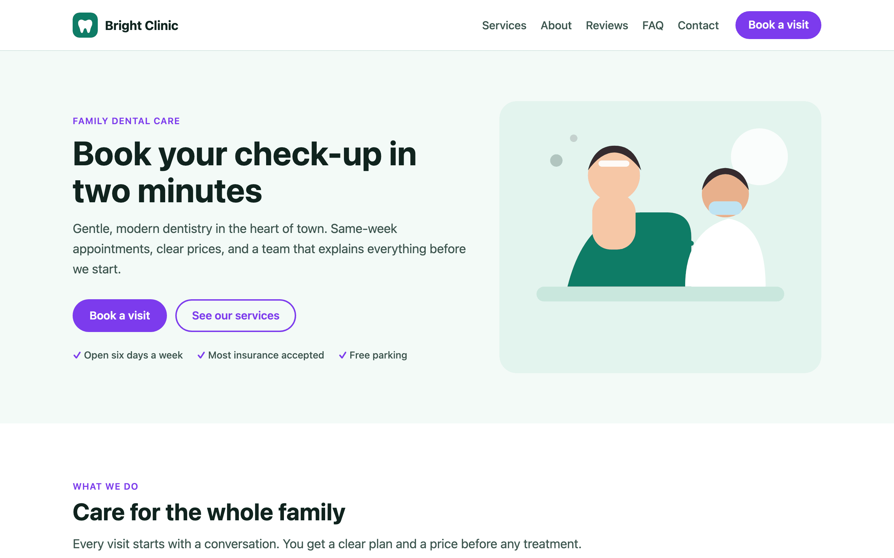
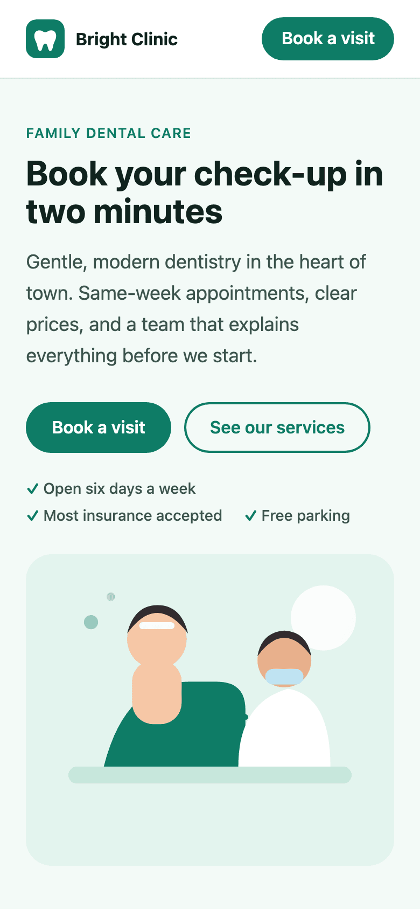
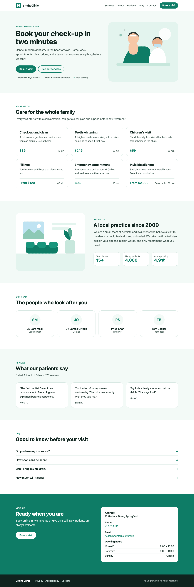

# Bright Clinic — landing page template

A complete landing page for a clinic or practice. It's written for a dental clinic, and every text, picture, colour, link and list can be edited by the business in the page builder.



| The business’s own brand colour | On a phone | The whole page |
| --- | --- | --- |
|  |  | <a href="screenshots/full-page.png"></a> |

The purple version is the same template with no changes. It follows the page's brand colour (`--primary`), so every business gets its own look.

## Sections

| Section | Settings a business can edit |
| --- | --- |
| `nav` — top bar | Business name, logo, menu links (list), button text and link |
| `hero` | Background colour, small line, headline, subheading, two buttons, trust points (list), photo and its description |
| `services` | Heading, intro, services (list of name / description / price / duration) |
| `about` | Heading, text, photo, numbers (list of value / label) |
| `team` | Heading, team members (list of name / role / initials) |
| `reviews` | Heading, rating line, reviews (list of quote / author) |
| `faq` | Heading, questions (list of question / answer), using `<details>` so it works without JavaScript |
| `contact` | Heading, text, button, address, phone, email, opening hours (list) |
| `footer` | Business name, links (list), small print |

## What it shows you

- **Repeating lists** with `{{#each services}}…{{/each}}`. When a business adds a seventh service in the page builder, a seventh card appears.
- **Brand colours that follow the business.** Everything uses `hsl(var(--primary, 164 80% 27%))`, so the template takes on each business's own colour. Try `--primary=#7C3AED` in the preview.
- **Images as settings** (`"type": "image"`), so businesses swap pictures in the page builder.
- **Shared base styles repeated in every section,** so any section still looks right on its own. Overrides use a more specific selector.
- **A phone layout for every section** in `*.mobile.css`.
- **Keys that match "Preview with my business info"** (`business_name`, `phone`, `email`, `address`, `services`, `reviews`), so a business can preview the template with its own details before installing it.

## Run it

```bash
node tools/preview.mjs examples/landing-template-bright-clinic                      # → http://localhost:4300
node tools/preview.mjs examples/landing-template-bright-clinic --primary=#7C3AED    # another brand colour
node tools/validate.mjs examples/landing-template-bright-clinic
```

## Make it yours

1. Change the copy and defaults in `manifest.json`. Defaults are what a business sees before editing.
2. To add a section, create `sections/pricing.html`, `.css` and `.mobile.css`, then add an entry to `sections` with its settings. Every `{{ key }}` in the HTML must be a setting.
3. Rename the `bc-` class prefix to your own, so your template never clashes with another one on the same page.
