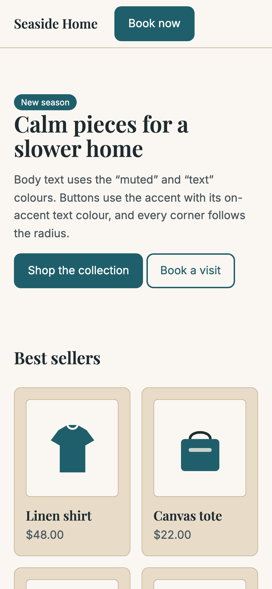

# Harbor Linen — store theme

Calm linen tones, a deep teal accent and Playfair Display headings, for home and lifestyle stores.

| On a sample store (`tools/preview.mjs`) | On a phone |
| --- | --- |
|  |  |

| Token | Value | Used for |
| --- | --- | --- |
| background | `#FAF7F2` | Page background |
| surface | `#E8DCC8` | Product cards, panels and forms, deep enough to stand out from the page |
| text | `#1F2A2E` | Body text and headings (13.8:1 on the background) |
| muted | `#4A555C` | Prices and captions (5.6:1 on the surface) |
| accent | `#1F5F6B` | Buttons and links |
| on_accent | `#FFFFFF` | Button text (7.2:1 on the accent) |
| border | `#C9B89C` | Card outlines and dividers |
| fonts | Playfair Display 600 / Inter 400 | Headings / body |
| radius | 10px | Buttons, cards and fields |

## Run it

```bash
node tools/preview.mjs examples/store-theme-harbor-linen   # → http://localhost:4310 (a sample store)
node tools/validate.mjs examples/store-theme-harbor-linen  # schema + contrast
node tools/pack.mjs examples/store-theme-harbor-linen      # → dist/store-theme-harbor-linen-2.0.0.theme.json
```

## Make it yours

Change the colours and fonts, then run `validate.mjs` until all four contrast pairs pass. Keep the surface visibly different from the background: that's exactly why v1.0.0 of this theme was sent back in review.
